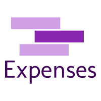
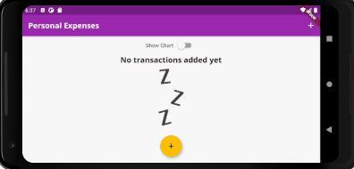

<h1 align="center">
  <br>
  
  <br>
  Personal Expenses
  <br>
</h1>

<h4 align="center">An application made by <a href="https://flutter.dev/" target="_blank">Flutter</a></h4>


<p align="center">
  <a href="#what-is-it">What is it</a> •
  <a href="#getting-started">Getting Started</a> •
  <a href="#preview">Preview</a> •
</p>

## What is it
<hr>
This is an application that allows you to manage your expenses, the application show you all your payments in an scrollable list and shows you the expenses of the week in a chart with the percentage of money used on each day of the week. 
The application adapts to different screen sizes and works well in normal or landscape mode, with minor modifications to improve on-screen display.

## Getting Started
<hr>
Make sure you have an emulator, or a device connected over USB and debugging enabled on that device to run your application there.

#### 1. [Setup Flutter](https://flutter.io/setup/)

#### 2. Clone the repo

In the Command Prompt (CMD):

```sh
$ git clone https://github.com/matifrancois/Expenses-Flutter-App
$ cd Expenses-Flutter-App
```

#### 4. Run the app

```sh
$ flutter run
```


## Preview
<hr>

### Portrait Mode


### Landscape Mode




