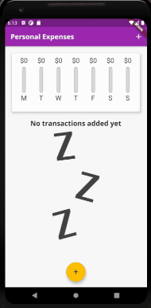

# First_app

This is an application made by flutter that allows you to manage your expenses, the application show you all your payments in an scrollable list and shows you the expenses of the week in a chart with the percentage of money used on each day of the week. 
The application adapts to different screen sizes and works well in normal or landscape mode, with minor modifications to improve on-screen display.

## Getting Started

To run the code, switch to that example's directory, and use flutter run (you have to have installed flutter on your machine). Make sure you have an emulator running, or a device connected over USB and debugging enabled on that device.

Then in the Command Prompt (CMD):

cd thepath/ofthefolder/of_ExpensesApp
flutter run

